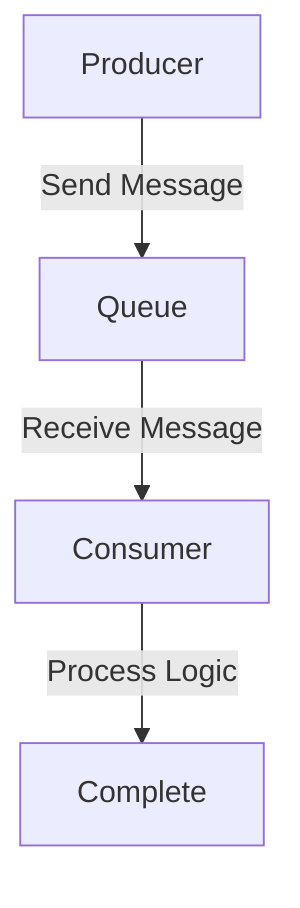
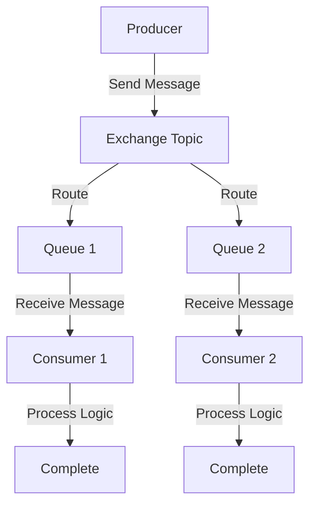
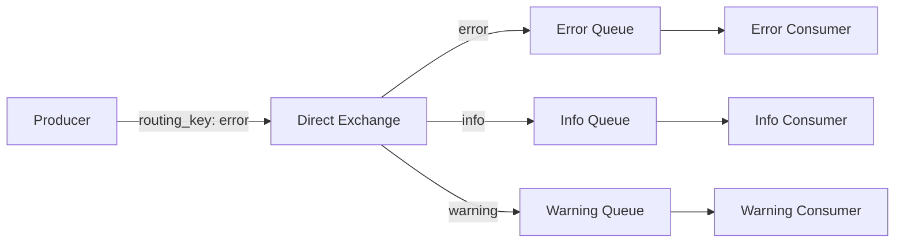
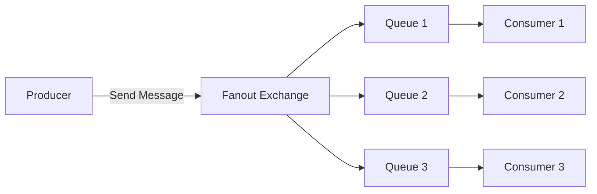
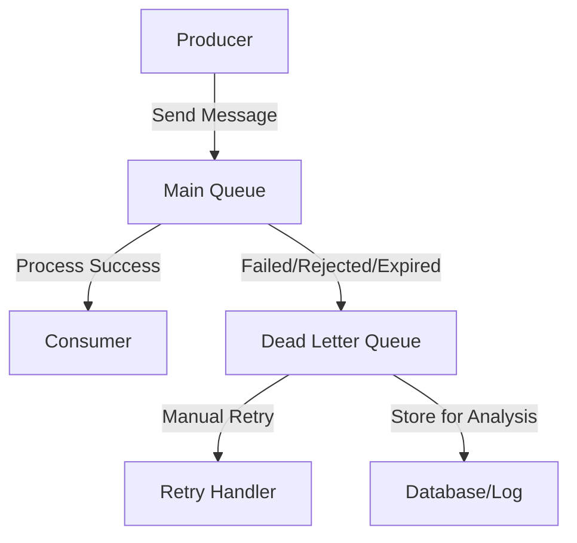
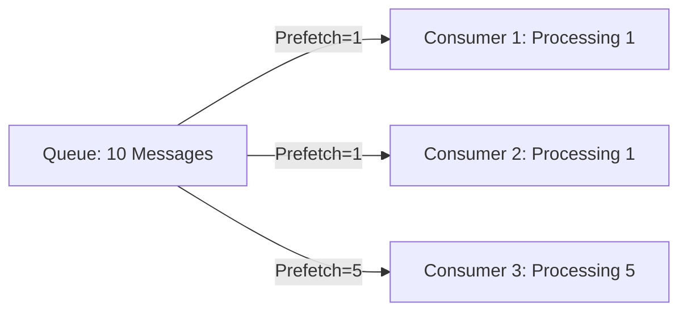

# Service Bus & Message Broker - Hướng Dẫn Từng Bước

## Giới Thiệu

Tài liệu này cung cấp hướng dẫn chi tiết về Service Bus và Message Broker, tập trung vào RabbitMQ. Chúng ta sẽ khám phá lý thuyết cơ bản, các khái niệm chính, ưu điểm, và cú pháp thực tế để triển khai Producer và Consumer.

---

## A. Lý Thuyết Cơ Bản

### I. Cách Hoạt Động của Message Broker

Message Broker đóng vai trò trung gian giữa các dịch vụ, cho phép giao tiếp không đồng bộ thông qua hàng đợi (Queue) hoặc chủ đề (Topic).

#### 1. <span style="color: #007BFF;">Queue (Hàng Đợi)</span>
- **Định nghĩa:** Một message được gửi đến một receiver duy nhất.
- **Ví dụ:** Message được gửi đi, dịch vụ A nhận và xử lý logic.
- **Đặc điểm:** Nếu nhiều consumer cùng subscribe queue, mỗi message chỉ đến một trong số họ (tương tự như lấy số thứ tự ở ngân hàng, ai rảnh thì xử lý).

**Minh Họa:**



#### 2. <span style="color: #28A745;">Topic (Chủ Đề - Giống Như Loa Phát Thanh)</span>
- **Định nghĩa:** Một message được gửi đến nhiều receiver.
- **Ví dụ:** Message được gửi đi, bất kỳ dịch vụ nào có subscribe sẽ nhận và xử lý.

**Minh Họa:**



---

### II. Các Khái Niệm Cơ Bản

#### 1. <span style="color: #DC3545;">Producer (Publisher) - Người Gửi Thư</span>
- Là thực thể gửi message.
- Gửi message vào queue hoặc topic.

#### 2. <span style="color: #FFC107;">Consumer (Subscriber) - Người Nhận Thư</span>
- Là thực thể nhận và xử lý message.
- Lắng nghe và xử lý các message nhận được.

#### 3. <span style="color: #6F42C1;">Queue - Thùng Thư</span>
- Là hàng đợi lưu trữ message cho đến khi Consumer subscribe để nhận.
- Nếu nhiều consumer cùng subscribe, mỗi message chỉ đến một consumer.

#### 4. <span style="color: #17A2B8;">Exchange - Đài Phát Thanh</span>
- Là điểm định tuyến message đến các queue phù hợp.
- Quyết định message nào đi vào queue nào dựa trên các quy tắc.
- Mỗi consumer có queue riêng, cùng subscribe vào một topic/exchange, nên tất cả nhận bản sao của message.

**Các Loại Exchange trong RabbitMQ:**

| Loại     | Mô Tả                                                                 |
|----------|-----------------------------------------------------------------------|
| **Direct** | Định tuyến message dựa trên routing key chính xác. Queue nhận message khớp hoàn toàn. |
| **Fanout** | Định tuyến message đến tất cả queue đã bind với exchange.             |
| **Topic**  | Định tuyến message theo pattern của routing key. Ví dụ: pattern `*.Bombay.*` nhận `User.Bombay.Message`. |
| **Header** | Sử dụng header của message để định tuyến.                             |

**Minh Họa Direct Exchange:**



**Minh Họa Fanout Exchange:**



---

### III. Ưu Điểm

**Không Mất Dữ Liệu**
- Nếu một dịch vụ bị tắt, message vẫn lưu trong queue.
- Khi dịch vụ khởi động lại, tiếp tục xử lý mà không cần request lại.

**Tính Mở Rộng Cao**
- Sử dụng Topic cho nhiều consumer xử lý logic đồng thời.
- Phân tán tải, xử lý nhanh hơn.

**Tách Biệt Logic**
- Producer và Consumer có thể viết bằng nhiều ngôn ngữ khác nhau.
- Hỗ trợ: C#, Java, Python, Node.js, v.v.

---

### IV. Các Khái Niệm Nâng Cao

#### 1. <span style="color: #FF6B6B;">Message Acknowledgment (Xác Nhận Message)</span>
- **Auto Ack (true):** Message tự động bị xóa khỏi queue ngay khi consumer nhận.
- **Manual Ack (false - Khuyến nghị):** Consumer phải gọi `BasicAck` sau khi xử lý xong.
- **Nack/Reject:** Consumer có thể từ chối message và yêu cầu queue xử lý lại hoặc loại bỏ.

**Ví dụ Manual Ack:**
```csharp
channel.BasicConsume(
    queue: "my-queue",
    autoAck: false,
    consumer: consumer
);

// Sau khi xử lý xong
channel.BasicAck(deliveryTag: ea.DeliveryTag, multiple: false);
```

#### 2. <span style="color: #4ECDC4;">Dead Letter Queue (DLQ)</span>
- **Định nghĩa:** Queue đặc biệt để lưu các message bị lỗi hoặc không thể xử lý.
- **Khi nào message vào DLQ:**
  - Consumer reject message với `requeue = false`
  - Message hết hạn (TTL - Time To Live)
  - Queue đầy (max length reached)

**Minh Họa Dead Letter Queue:**



**Cấu hình DLQ:**
```csharp
var args = new Dictionary<string, object>
{
    { "x-dead-letter-exchange", "dlx-exchange" },
    { "x-dead-letter-routing-key", "failed-messages" }
};

channel.QueueDeclare(
    queue: "main-queue",
    durable: true,
    exclusive: false,
    autoDelete: false,
    arguments: args
);
```

#### 3. <span style="color: #95E1D3;">Message Durability (Độ Bền Message)</span>
- **Durable Queue:** Queue tồn tại sau khi RabbitMQ restart.
- **Persistent Message:** Message được lưu vào disk, không mất khi broker crash.

**Cấu hình:**
```csharp
// Durable Queue
channel.QueueDeclare(
    queue: "durable-queue",
    durable: true,  // Queue sẽ tồn tại sau restart
    exclusive: false,
    autoDelete: false,
    arguments: null
);

// Persistent Message
var properties = channel.CreateBasicProperties();
properties.Persistent = true;  // Message lưu vào disk

channel.BasicPublish(
    exchange: "",
    routingKey: "durable-queue",
    basicProperties: properties,
    body: messageBytes
);
```

#### 4. <span style="color: #F38181;">Prefetch Count (Giới Hạn Message)</span>
- **Định nghĩa:** Số lượng message tối đa mà consumer nhận trước khi phải ack.
- **Lợi ích:** Cân bằng tải giữa các consumer, tránh consumer yếu bị quá tải.

**Cấu hình:**
```csharp
channel.BasicQos(
    prefetchSize: 0,
    prefetchCount: 1,  // Consumer chỉ nhận 1 message tại một thời điểm
    global: false
);
```

**Minh Họa Prefetch:**



---

## B. Cú Pháp và Pseudo Code

### I. Producer (Người Gửi Message)

**Kết nối và gửi message vào queue:**

```csharp
// Kết nối tới RabbitMQ
var connection = CreateConnection();
var channel = connection.CreateChannel();

// Gửi message vào queue
channel.BasicPublish(
    exchange: "",                    // Tên exchange. "" = gửi trực tiếp vào queue
    routingKey: "csv-import-queue",  // Tên queue muốn gửi message vào
    body: messageBytes               // Nội dung message (dạng byte[])
);
```

**Giải thích các thuộc tính:**
- `exchange`: Tên của exchange. Nếu trống (`""`), message đi thẳng vào queue theo routingKey.
- `routingKey`: Tên của queue hoặc topic đích.
- `body`: Dữ liệu message (thường là JSON hoặc byte[]).

---

### II. Consumer (Người Nhận Message)

**Kết nối và nhận message từ queue:**

```csharp
// Kết nối tới RabbitMQ
var connection = CreateConnection();
var channel = connection.CreateChannel();

// Đăng ký nhận message từ queue
channel.BasicConsume(
    queue: "csv-import-queue",       // Tên queue muốn nhận message
    autoAck: false,                  // Có tự động xác nhận đã nhận message không
    consumer: myConsumer             // Đối tượng xử lý message nhận được
);
```

**Giải thích các thuộc tính:**
- `queue`: Tên queue muốn nhận message.
- `autoAck`:
  - `true`: Message coi là đã xử lý ngay khi nhận.
  - `false` (khuyến nghị): Phải gọi `BasicAck` sau khi xử lý để đảm bảo không mất dữ liệu.
- `consumer`: Hàm hoặc đối tượng xử lý message khi nhận.

---

### III. Exchange & Topic (Định Tuyến Nâng Cao)

**Tạo exchange kiểu topic:**

```csharp
// Tạo exchange
channel.ExchangeDeclare(
    exchange: "csv-changes-topic",   // Tên exchange
    type: "topic",                   // Kiểu exchange (topic, direct, fanout, ...)
    durable: true                    // Có lưu lại khi restart broker không
);

// Bind queue vào exchange với routing key
channel.QueueBind(
    queue: "myQueue",                // Tên queue
    exchange: "csv-changes-topic",   // Tên exchange
    routingKey: "csv.*"              // Pattern routing (csv.import, csv.export, ...)
);
```

**Giải thích các thuộc tính:**
- `exchange`: Tên exchange (nơi phát tán message).
- `type`: Kiểu exchange (`topic`, `direct`, `fanout`, `header`).
- `durable`: Nếu `true`, exchange tồn tại sau khi broker restart.
- `queue`: Tên queue nhận message từ exchange.
- `routingKey`: Pattern lọc message.
  - `csv.*` → nhận `csv.import`, `csv.export`, ...
  - `csv.import` → nhận chính xác `csv.import`.

---

*Tài liệu này được cập nhật lần cuối vào ngày 18 tháng 11 năm 2025.*